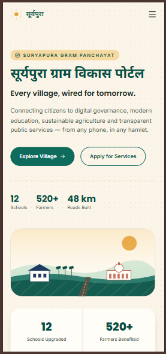
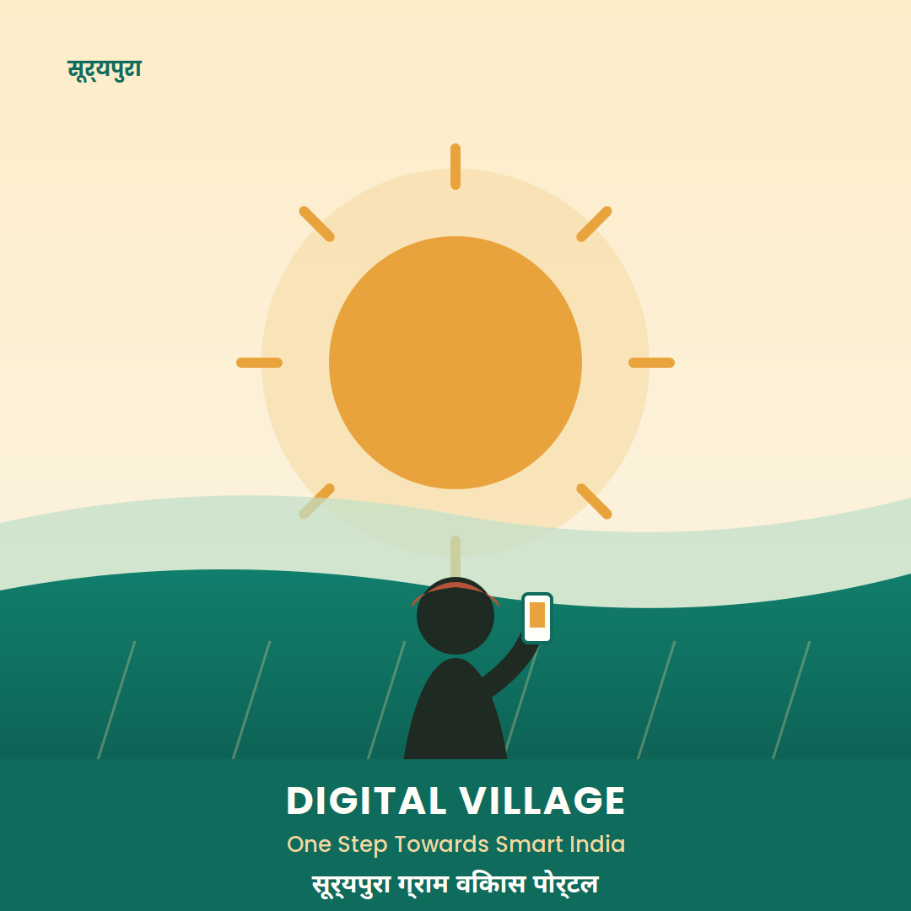
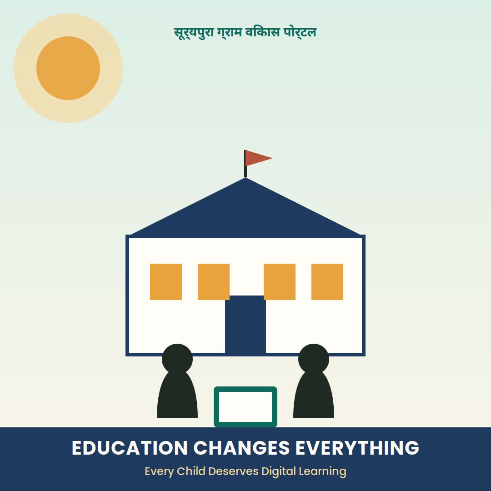

# 🌾 सूर्यपुरा ग्राम विकास पोर्टल (Suryapura Smart Village Portal)

A fictional **Rural Development Portal** built for a **Full Stack Developer technical assessment** — a modern, premium, responsive village-development platform covering digital governance, education, agriculture, infrastructure, Panchayat services, and citizen welfare.


## 🌐 Live Demo

👉 **https://suryapura-portal-self.vercel.app/**

---

## 📌 Project Overview

Suryapura Gram Vikas Portal demonstrates modern web development practice using **Next.js**, **TypeScript**, and **Tailwind CSS**, styled to feel like a real government digital service rather than a static mockup. It's built around six pillars of village development:

🌾 Agriculture · 📚 Education · 🏥 Healthcare · 🛣 Road Development · 🏛 Panchayat Services · 💳 Digital Identity

...plus government schemes, citizen services, village announcements, success stories, and a development gallery.

## ✅ Assessment Requirements

| Requirement | Status |
|---|---|
| Homepage mockup / live demo | ✅ [Live on Vercel](https://suryapura-portal-self.vercel.app/) |
| Hero banner | ✅ |
| 2 social media posts (1080×1080) | ✅ [`docs/screenshots`](docs/screenshots) |
| Mobile view screenshot | ✅ [`docs/screenshots`](docs/screenshots) |
| Short design explanation | ✅ [`DESIGN_EXPLANATION.md`](DESIGN_EXPLANATION.md) |

---

## ✨ Features

- Responsive landing page, mobile-first
- Custom hand-built SVG hero illustration and sun-motif brand system (not stock art)
- Animated statistics counters
- Village development timeline
- Six-pillar development areas grid
- Citizen services (certificate applications etc.)
- Government schemes
- Illustrated development ambassador / leader section
- Success stories
- Photo gallery (real, credited photography — see [`submission-assets/IMAGE_CREDITS.md`](submission-assets/IMAGE_CREDITS.md))
- Call-to-action + footer
- English / Hindi language toggle
- Scroll and hover animations via Framer Motion
- Respects `prefers-reduced-motion`

## 🛠 Tech Stack

**Frontend:** Next.js · React · TypeScript · Tailwind CSS · Framer Motion
**Icons:** Lucide React
**Deployment:** Vercel

## 📁 Folder Structure

```text
src/
├── app/
│   ├── layout.tsx        Root layout, fonts, metadata
│   ├── page.tsx           Composes every homepage section
│   └── globals.css         Design tokens (colors, fonts) + Tailwind
├── components/
│   ├── Navbar.tsx          Sticky nav + EN/HI language toggle
│   ├── Hero.tsx             Hero with custom SVG village illustration
│   ├── Stats.tsx             Animated counters
│   ├── News.tsx               Announcements strip
│   ├── Vision.tsx              Mission + development timeline
│   ├── DevelopmentAreas.tsx     Six-pillar card grid
│   ├── Services.tsx              Citizen services (certificates etc.)
│   ├── Schemes.tsx                Government scheme cards
│   ├── Leader.tsx                  Illustrated ambassador quote block
│   ├── Stories.tsx                  Success story cards
│   ├── Gallery.tsx                   Photo grid
│   ├── CTA.tsx                        Call to action band
│   ├── Footer.tsx                      Footer + contact
│   ├── SunMotif.tsx                     Signature SVG sun/skyline/portrait art
│   ├── SectionHeading.tsx                Reusable section heading
│   └── Counter.tsx                        Animated number component
└── lib/
    ├── data.ts             All homepage content (edit here to change copy)
    └── language.tsx          EN/HI language context
```

## 🚀 Installation

Requires **Node.js 20+**.

```bash
git clone https://github.com/NiranjanaNS/Suryapura-portal.git
cd Suryapura-portal
npm install
npm run dev
```

Visit `http://localhost:3000`.

## 📦 Production Build

```bash
npm run build
npm run start
```

## 🔍 Linting

```bash
npm run lint
```

---

## 🎯 Design Highlights

Clean, premium, mobile-first — inspired by modern government portals. The palette:

- 🌿 **Teal** (`#0F6B5C`) — agriculture & sustainability
- 🟡 **Marigold** (`#E8A33D`) — growth & prosperity, tied to "Suryapura" (Sun City)
- 🔵 **Indigo** (`#1E3A5F`) — digital governance
- 🤍 **Warm paper** (`#FBF5E9`) — simplicity & accessibility

Full reasoning in [`DESIGN_EXPLANATION.md`](DESIGN_EXPLANATION.md).

## 📸 Preview

### Mobile View


### Social Media Post 1


### Social Media Post 2


## 📱 Responsive Design

Optimized for desktop, laptop, tablet, and mobile.

## 🌍 Deployment

Deployed on Vercel — see [`DEPLOYMENT.md`](DEPLOYMENT.md) for the full guide (and why Vercel over GitHub Pages for a Next.js app).

## 🔮 Future Enhancements

- Express.js backend with REST APIs (announcements, projects, gallery, services, schemes)
- MongoDB database
- Admin dashboard with JWT authentication and CRUD screens
- Image upload for gallery/announcements
- Contact form backend
- Backend deployed on Render + MongoDB Atlas

## 👩‍💻 Developer

**Niranjana N Sajeev**
GitHub: https://github.com/NiranjanaNS · LinkedIn: https://www.linkedin.com/in/NiranjanaNSajeev/

## 📄 License

MIT — see [`LICENSE`](LICENSE).

All names, places, characters, and content in this project are fictional and created solely for demonstration purposes as part of a technical assessment.
